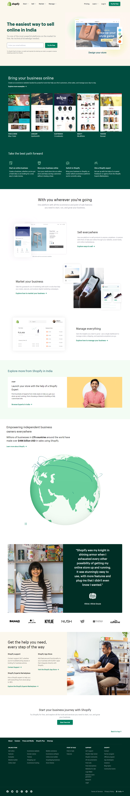

# SHOPIFY CLONE

I have made Shopify clone with the help of HTML and CSS Tailwind. It is mobile responsive as well. Go check it out. 

***
### Name: SOURITA RAY
***
## Demo

## Mobile screen layout: 

## What have I learnt in this project?

In this project I have got in-depth knowledge about 
- Tailwind classes
- hover effects on buttons.
- CSS transition and animation effects.

## Time required to complete the project

More than 1 day.

## Live link

[Shopify Clone](https://shopify-clone-souritaray.netlify.app/)

## Contact me on:

- [Linked In-Sourita Ray](www.linkedin.com/in/sourita-ray-89bab0212)
- [Email-id Sourita Ray](souritaray@gmail.com)

## Feedback

You can provide your feedback at souritaray@gmail.com
